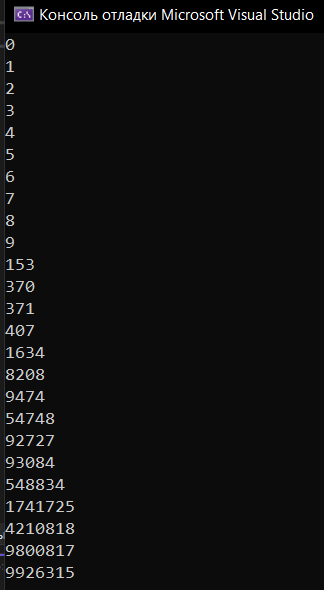
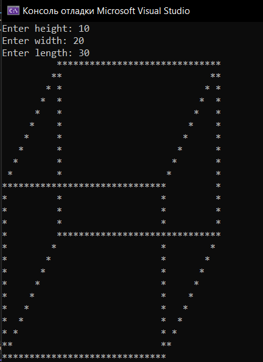
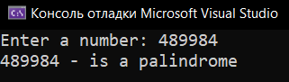
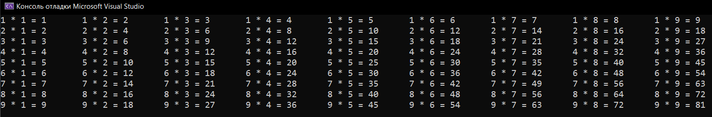
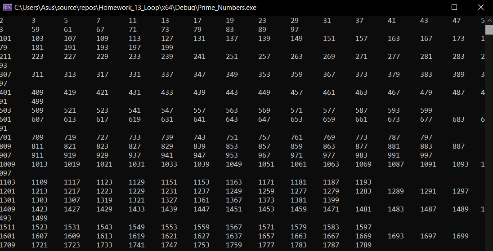

# Homework_13_Loop
Д/з: Loop

<a href="https://gist.github.com/SlavikArt/ace9c14e488f9199cd3b429605c6509e">Gist - страница со всеми кодами проектов</a>

* [Armstrong_Number](Armstrong_Number)
* [Console_Parallelepiped](Console_Parallelepiped)
* [Is_Palindrome](Is_Palindrome)
* [Multiplication_Table](Multiplication_Table)
* [Prime_Numbers](Prime_Numbers)

    <h2>Armstrong number</h2>
    
Armstrong numbers.

    
    <h2>Console parallelepiped</h2>
    
Parallelepiped.

    
    <h2>Is palindrome</h2>
    
Is palindrome.

    
    <h2>Multiplication table</h2>
    
Multiplication table.

    
    <h2>Prime numbers</h2>
    
Prime numbers.

    

